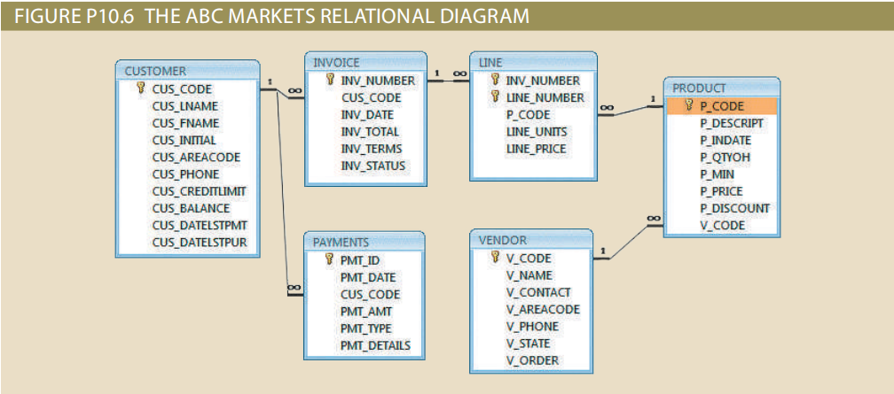
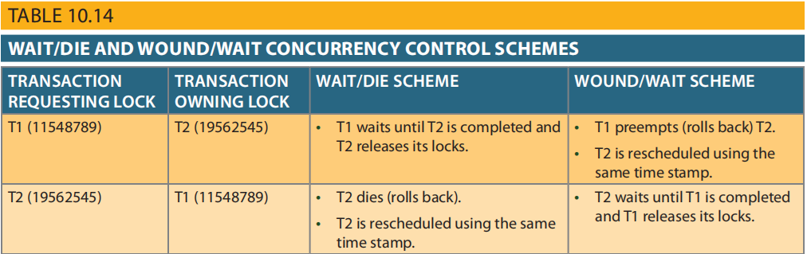

[](https://classroom.github.com/a/56W-ZKX_)
[](https://classroom.github.com/online_ide?assignment_repo_id=22081924&assignment_repo_type=AssignmentRepo)
# Transaction Management and Concurrency Control

This repository is used to submit your work for the **“Transaction Management and Concurrency Control”** practical assignment in the Database Systems course.

In this assignment you will:
- Apply ACID properties in the context of real business operations.
- Write SQL transactions using `BEGIN TRANSACTION`, `COMMIT`, and appropriate UPDATE/INSERT logic.
- Analyze concurrency control behavior, including transaction logs and pessimistic locking.
- Work with a realistic business schema (ABC Markets) shown in Figure P10.6.

---

## 1. Scenario Overview

ABC Markets sells products to customers. The relational diagram in **Figure P10.6** (included in the repo as `fig_p10_6.png`) shows the relevant entities:

- **CUSTOMER**
- **INVOICE**
- **LINE**
- **PRODUCT**
- **VENDOR**
- **PAYMENTS**

Use only the attributes shown in the diagram.

### Important Business Rules
- A customer may have many invoices.
- `CUS_BALANCE` increases with every credit purchase and decreases with every payment.
- `CUS_DATESTPUR` stores the date of the last purchase.
- `CUS_DATESTLPMT` stores the date of the last payment.
- Each invoice represents a customer purchase and may have multiple LINE entries.
- `INV_TOTAL` includes taxes.
- `INV_TERMS` ∈ {30, 60, 90, CASH, CHECK, CC}.
- `INV_STATUS` ∈ {OPEN, PAID, CANCEL}.
- `P_QTYOH` is reduced with each sale.
- Payments may be CASH, CHECK, or CREDIT CARD.
- `PMT_DETAILS` stores details for CHECK or CC payments.

Reference diagram:



---

## 2. Tasks

Create a file named **`answers.md`** (or `answers.sql`, `answers.pdf`, etc. if allowed) and provide complete solutions for tasks (6a), (6b), (7), and (8).

All SQL must follow proper transaction structure using:

```sql
BEGIN TRANSACTION;
-- your statements
COMMIT;
```

---

### **6a. Write SQL for the purchase transaction**

On **May 11, 2018**, customer **10010** makes a **credit purchase (30 days)**:

* Product: **11QER/31**
* Quantity: **1 unit**
* Unit price: **$110.00**
* Tax rate: **8%**
* Invoice number: **10983**
* Invoice has **one** product line

Your SQL must:

* Insert the invoice.
* Insert the invoice line.
* Update the product’s `P_QTYOH`.
* Update customer `CUS_BALANCE`.
* Update `CUS_DATESTPUR`.

Wrap all statements in a single transaction.

---

### **6b. Write SQL for the payment transaction**

On **June 3, 2018**, the same customer (**10010**) makes a **$100 cash payment**.

* Payment ID: **3428**

Your SQL must:

* Insert the payment.
* Update `CUS_BALANCE`.
* Update `CUS_DATESTLPMT`.

Wrap this in a transaction as well.

---

### **7. Create a transaction log**

Using the format of **Table 10.14** (included as `table_10_14.png`), create a simple chronological log describing the actions of:

* Transaction 6a (purchase)
* Transaction 6b (payment)

Example format is provided in the image:



You may create the log as a Markdown table.

---

### **8. Pessimistic Locking Analysis (2PL NOT used)**

Assume:

* ABC Markets uses **pessimistic locking**
* The **two-phase locking protocol (2PL) is NOT enforced**

Write a chronological list of operations for the full execution of **transaction 6a**:

* Lock acquisition
* Lock release
* Reads
* Writes (updates/inserts)
* Any potential anomalies caused by lack of 2PL

Describe them step by step, for example:

1. Transaction T1 requests lock on CUSTOMER…
2. Lock granted…
3. T1 updates CUS_BALANCE…
4. Lock on PRODUCT requested…
5. Lock released prematurely → possible inconsistency…

---

## 3. Academic Integrity

Your work must be written independently.
You may reference the textbook, lecture materials, and official SQL documentation, but **copy-paste of online solutions is not allowed**.

Happy transacting!
